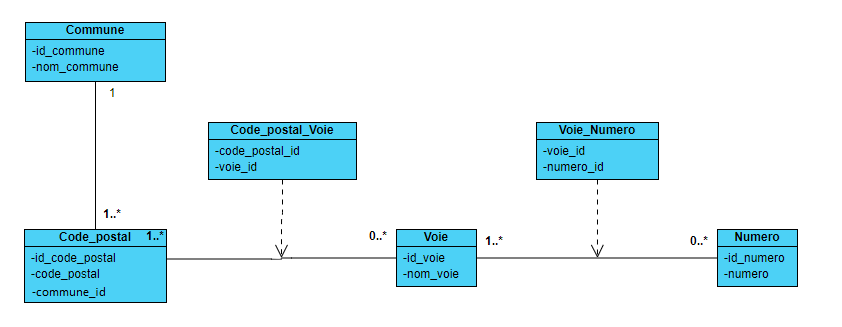

# Fantoir  
## Introduction  
Projet de création d'une routine avec Talend qui va permettre de créer et peupler une base de données qui devra être exposée via une API Rest avec Spring Boot  

## Pré-requis  
Talend version 7  
Java version 11  
Spring Boot version 2  
PostgreSQL  

## Jeux de données  
Les jeux de données utilsés pout la réalisation de ce projet sont localisés dans ce lien [BAN](https://adresse.data.gouv.fr/data/ban/adresses/latest/csv/)  

## Schéma de la base de données  
Ci-dessous le schéma de la base de données  


## Création de la base de données à partir d'un fichier csv  
Le job [talend job](job_talend/) permettera de migrer les données d'un fichier csv vers une base de données PostgreSql  
Le dossier [data](data/) contient un fichier exemple pour tester le job talend  

## Récuperer les adresses depuis l'api Rest  
Le dossier [api](api/) contient l'api Rest créée avec Spring Boot  
### Configuration de l'accées à la base de données PostgreSQL  
Dans le fichier `src/main/resources/application.properties`, veuillez ajouter les informations d'accées à la base de données  
```properties
spring.datasource.url=jdbc:postgresql://[server]:[port]/[database]?
spring.datasource.username=[username]
spring.datasource.password=[password]
```
### Tester l'api  
Après le lancement de l'api, vous pouvez y acceder depuis le lien  
`localhost/8080/adresse/search?adresse=[votre recherche]`  

Actuellement la page d'accueil lancée lors du demarrage de l'api ne marche pas correctement, l'api reste disponnible qu'avec un client api, vous pouvez utiliser [Talend API Tester](https://chrome.google.com/webstore/detail/talend-api-tester-free-ed/aejoelaoggembcahagimdiliamlcdmfm?hl=fr) sous chrome.
